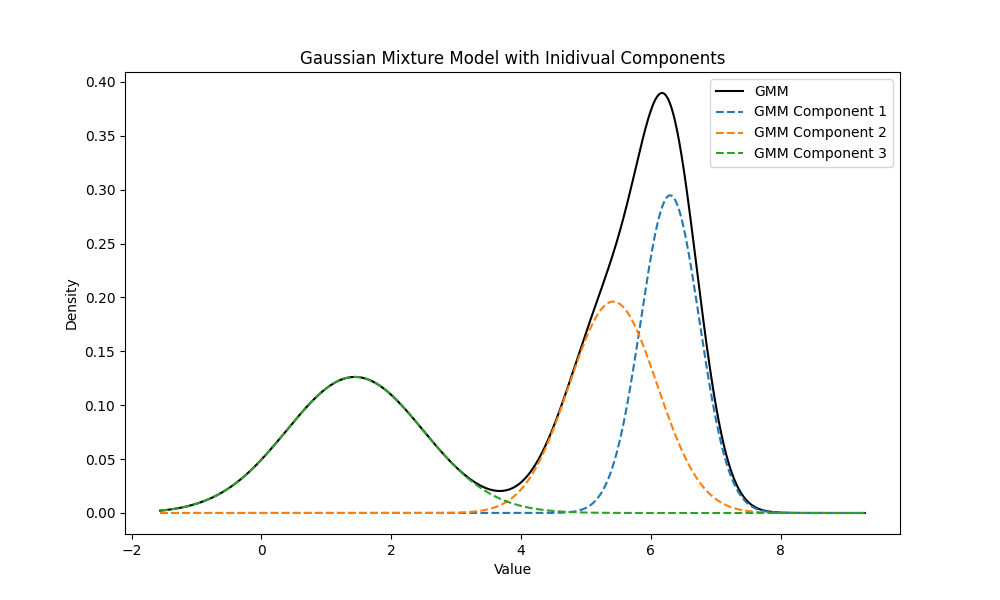
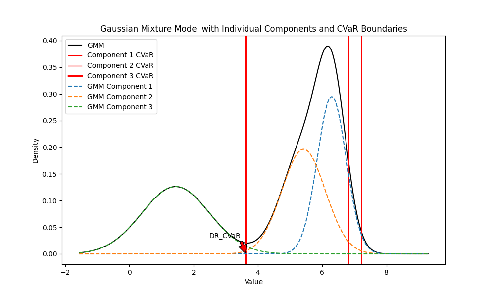

# Distributionally Robust CVaR Filter

This repository contains an implementation of a Distributionally Robust Conditional Value at Risk (CVaR) filter using Gaussian Mixture Models (GMM). The goal is to evaluate and manage risk in uncertain environments.

## Features
- Calculate Value at Risk (VaR) and Conditional Value at Risk (CVaR) for each Gaussian component of the GMM.
- Compute the Distributionally Robust CVaR from the GMM components.
- Check if the Distributionally Robust CVaR is within a specified boundary.

## Basic Definitions

### Notations
- $x$: Random variable representing the system state.
- $P^*$: True underlying distribution of $x$.
- $P$: Ambiguity set containing possible distributions of $x$.
- $\varepsilon$: Allowable probability.
- $l(x)$: Loss function, representing any general loss or cost associated with $x$.
- $\gamma$: Threshold value for the VaR.
- $\phi$: Probability density function (PDF) of the standard normal distribution.
- $\Phi$: Cumulative distribution function (CDF) of the standard normal distribution.
- $\Phi^{-1}$: Percent point function (PPF) or inverse CDF of the standard normal distribution.

### Probability Density Function (PDF)
The probability density function (PDF) of a normal distribution with mean $\mu$ and standard deviation $\sigma$ is given by:

```math
\phi(x) = \frac{1}{\sqrt{2\pi\sigma^2}} e^{-\frac{(x - \mu)^2}{2\sigma^2}}
```

### Percent Point Function (PPF)
The percent point function (PPF), also known as the inverse cumulative distribution function (inverse CDF), for the standard normal distribution, is the function $\Phi^{-1}(\varepsilon)$, which returns the value $x$ such that:

```math
\Phi(x) = \varepsilon
```


## Risk Measures

### Value at Risk (VaR)
The Value at Risk (VaR) at a confidence level $\alpha$ for a normal distribution with mean $\mu$ and standard deviation $\sigma$ is given by:

```math
\text{VaR}_\varepsilon = \mu + \sigma \cdot \Phi^{-1}(\varepsilon)
```
```math
\text{VaR}_{\varepsilon}^{P^*}(l(x)) := \inf\{\gamma \in \mathbb{R} \mid \text{Prob}^{P^*}(l(x) > \gamma) \leq \varepsilon\}
```

where $l(x)$ is the loss function.


### Conditional Value at Risk (CVaR)
The Conditional Value at Risk (CVaR) at a confidence level $\alpha$ is the expected loss given that the loss is beyond the VaR threshold. For a normal distribution, it is calculated as:

```math
\text{CVaR}_\varepsilon = \mu + \sigma \cdot \frac{\phi(\Phi^{-1}(\varepsilon))}{1 - \varepsilon}
```
```math
\text{CVaR}_{\varepsilon}^{P^*}(l(x)) := \inf_{\beta \in \mathbb{R}}\left\{\beta + \frac{1}{\varepsilon} \mathbb{E}_{P^*}\left[(l(x) - \beta)^{+}\right]\right\}
```

where $(\cdot)^{+}$ denotes the positive part.


### Distributionally Robust CVaR (DR-CVaR)
The Distributionally Robust CVaR from the GMM components is computed over an ambiguity set $\mathcal{P}$ of distributions. It is defined as:

```math
\sup_{P \in \mathcal{P}} \text{CVaR}_{\varepsilon}^{P}(l(x)) \leq 0 \Rightarrow \inf_{P \in \mathcal{P}} \text{Prob}^{P}(l(x) \leq 0) \geq 1 - \varepsilon
```

where $\mathcal{P}$ is the ambiguity set containing all possible distributions that are consistent with the known first and second-order moments of the data.


## Installation

To install the required packages, run:
```bash
pip install -r requirements.txt
```


## Example plot

### GMM Plot


### GMM with DR-CVaR Boundaries



## Running the Example
To generate the plots and see the Distributionally Robust CVaR in action, run:
```bash
python example_usage.py
```
This script will:

1. Create a Gaussian Mixture Model (GMM) with predefined Gaussian and Inverse-Gamma distributions.
Plot the GMM.
2. Initialize the Distributionally Robust CVaR filter.
3. Compute and print the Distributionally Robust CVaR.
4. Check if the CVaR is within a specified boundary.
5. Plot the GMM with individual components and CVaR boundaries.

License
-------
The contents of this repository are covered under the [MIT License](LICENSE).


