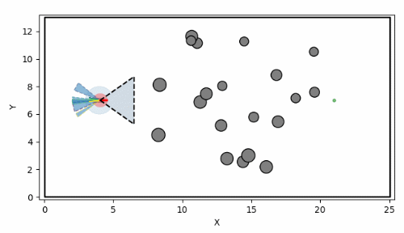
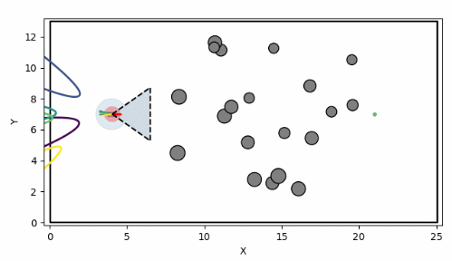
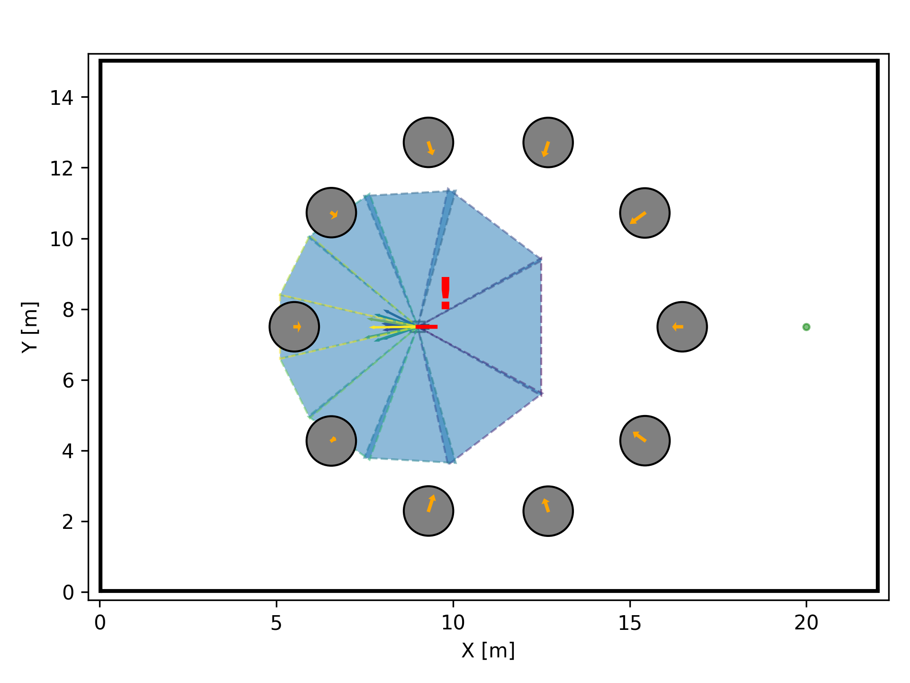
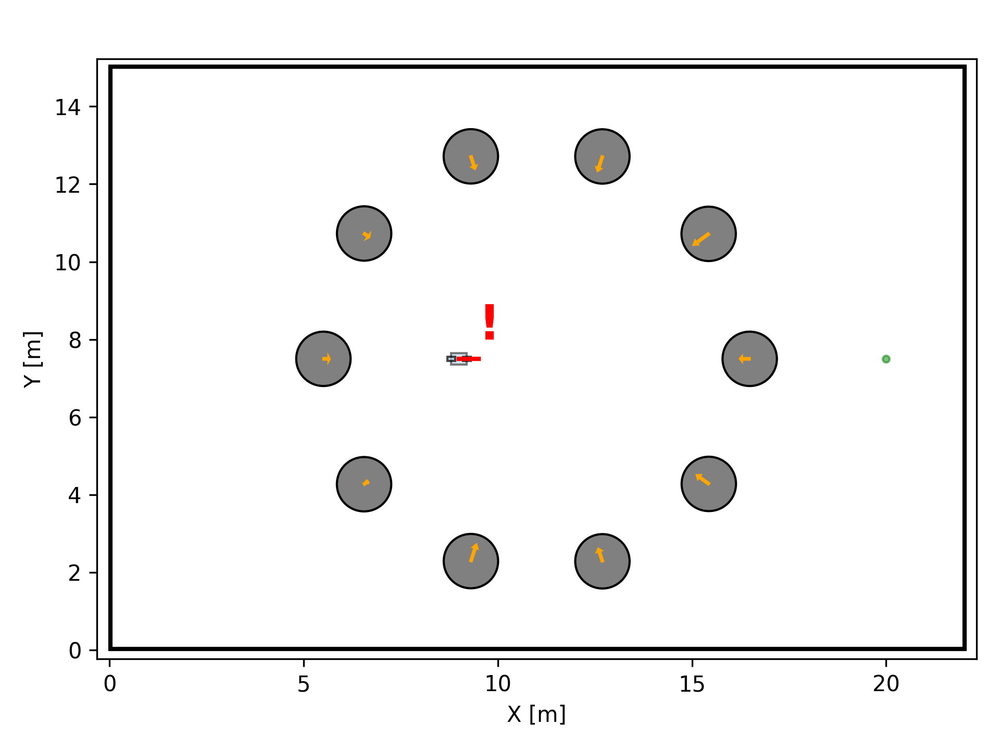
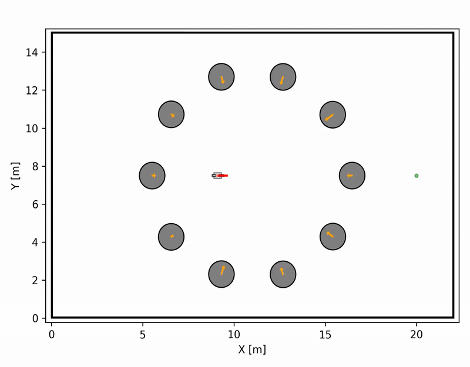
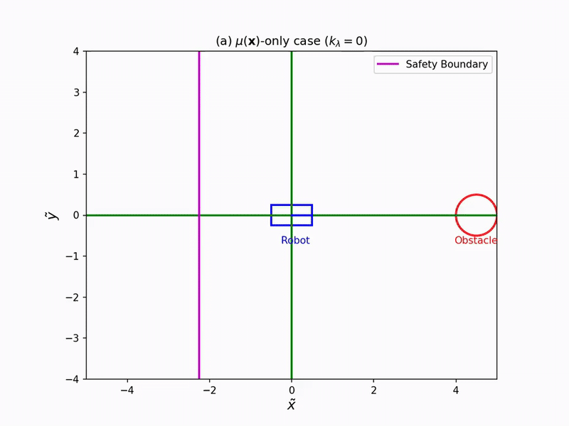
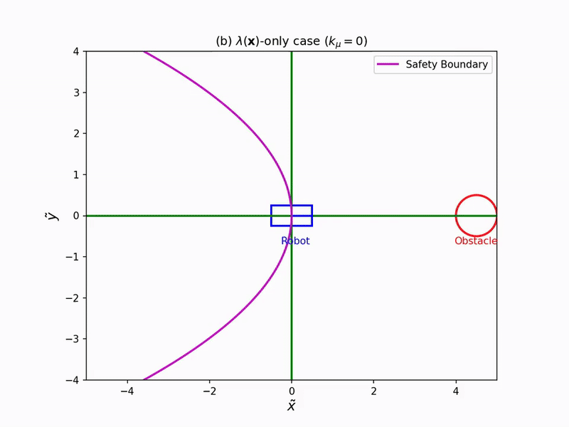
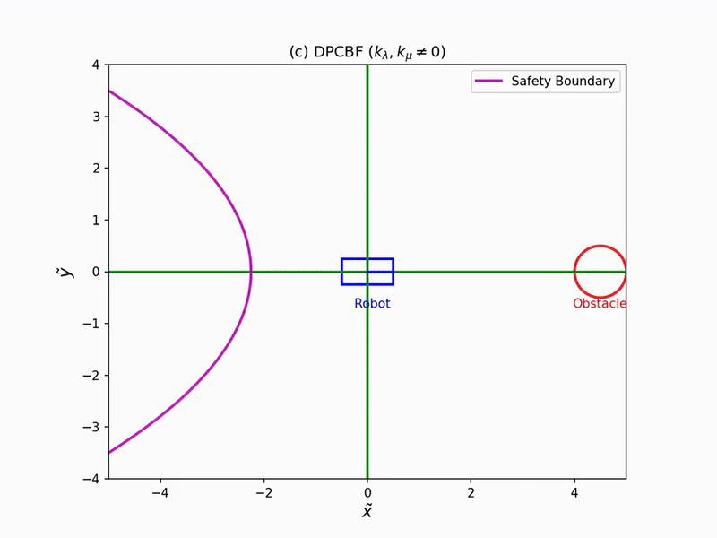

# Dynamic Parabolic Control Barrier Functions

The Dynamic Parabolic Control Barrier Function (DPCBF) is a safety-critical controller that enables safe dynamic obstacle avoidance for the kinematic bicycle model. Its detailed implementation can be found in `kinematic_bicycle2D_dpcbf.py` within the `safe_control` library. Please refer to our paper ["Beyond Collision Cones: Dynamic Obstacle Avoidance for Nonholonomic Robots via Dynamic Parabolic Control Barrier Functions"]() for more details.

<div align="center">

<div align="center">

</div>
</div>

## How to Run Example
You can run the test example for DPCBF by:
```bash
python dynamic_env/main.py
```

Alternatively, you can import `LocalTrackingControllerDyn` from 'main.py'
```python
from dynamic_env.main import LocalTrackingControllerDyn
# initialize LocalTrackingControllerDyn for a single robot with a predefined environment, obstacles, and waypoints.
single_agent_main(controller_type={'pos': 'cbf_qp'})
```

You can test the baseline algorithm:
- [C3BF](https://arxiv.org/abs/2403.07043):
    - by setting `model = 'KinematicBicycle2D_C3BF'`.

The sample results of the dynamic obstacle environments:
|                                                     C3BF                                                    |                                                                       DPCBF                |
| :------------------------------------------------------------------------------------------------------------------------: | :----------------------------------------------------------------------------------------------------------------------------: |
|   |  |


### Comparison (Surrounded by Obstacles)
|      C3BF            |      MA-CBF-VO            |
| :-------------------------------: | :-------------------------------: |
|   |   |

|      Dynamic Zone-based CBF            |      DPCBF            |
| :-------------------------------: | :-------------------------------: |
|   |   |


### More Examples

|     max_obs_radius = 0.3 m              |              max_obs_radius = 0.5 m        |              max_obs_radius = 0.7 m        |
| :------------------------------------------------------------------------------------------------------------------------: | :----------------------------------------------------------------------------------------------------------------------------: | :----------------------------------------------------------------------------------------------------------------------------: |
|   |  |  |


## Implementation Details

The following code implements the DPCBF for a `kinematicBicycle2D` model. It overrides the base class's `agent_barrier` method to compute the continous-time DPCBF and its gradient, which are then used by a CBF-QP controller.
```python
class KinematicBicycle2D_DPCBF(KinematicBicycle2D):
    def __init__(self, dt, robot_spec):
        super().__init__(dt, robot_spec)

```

Define the relative position and velocity between the robot and the obstacle.
```python
# Compute relative position and velocity
        p_rel = np.array([[obs[0] - X[0, 0]], 
                        [obs[1] - X[1, 0]]])
        v_rel = np.array([[obs_vel_x - v * np.cos(theta)], 
                        [obs_vel_y - v * np.sin(theta)]])
# Compute norms
        p_rel_mag = np.linalg.norm(p_rel)
        v_rel_mag = np.linalg.norm(v_rel)
```

By rotating the coordinates by an angle rot_angle, the new x-axis of the new coordinate frame is aligned with the vector from the robot to the obstacle, p_rel. We refer to the rotated frame by the rotation matrix R as LoS frame. Then, we define the relative velocity in the LoS frame. This transformation simplifies the definition of the parabolic safety boundary.
```python
# Rotation angle and transformation
rot_angle = np.arctan2(p_rel_y, p_rel_x)
R = np.array([[np.cos(rot_angle), np.sin(rot_angle)],
            [-np.sin(rot_angle),  np.cos(rot_angle)]])

# Transform v_rel into the new coordinate frame
v_rel_new = R @ v_rel
v_rel_new_x = v_rel_new[0, 0]
v_rel_new_y = v_rel_new[1, 0]
```

```python
# Compute clearance safely
eps = 1e-6
d_safe = np.maximum(p_rel_mag**2 - ego_dim**2, eps)
```

We introduce DPCBF functions with tunable hyperparameters, which can adjust the curvature of the parabola and shift the parabola forward by the safe distance margin. Finally, we propose Dynamic Parabolic CBF (DPCBF).
```python
# DPCBF functions
func_lamda = self.k_lambda * np.sqrt(d_safe) / v_rel_mag
func_mu = self.k_mu * np.sqrt(d_safe)

# Barrier function h(x)
h = v_rel_new_x + lamda * (v_rel_new_y**2) + mu
```

Three examples describe how a parabolic region in the new plane shapes the safety boundary:

|     mu(x)-only case              |              lambda(x)-only case        |              DPCBF        |
| :------------------------------------------------------------------------------------------------------------------------: | :----------------------------------------------------------------------------------------------------------------------------: | :----------------------------------------------------------------------------------------------------------------------------: |
|   |  |  |

Now, our DPCBF formulation defines a parabolic safety boundary with a Line-of-Sight coordinate frame to explicitly consider both the distance to an obstacle and the relative velocity. DPCBF considers the robot is safe as long as its relative velocity vector stays outside the parabolic region.
